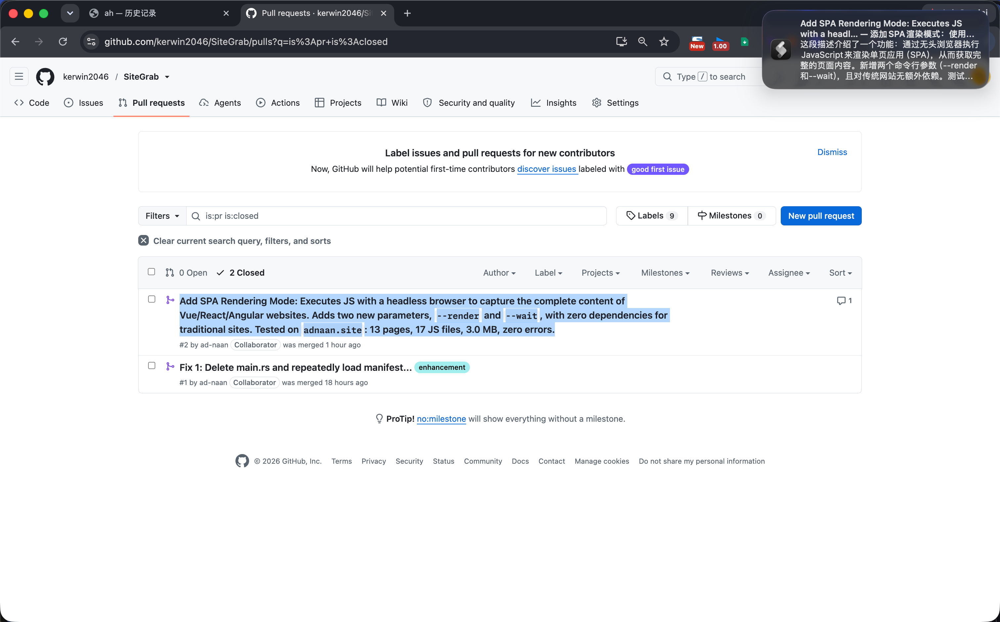
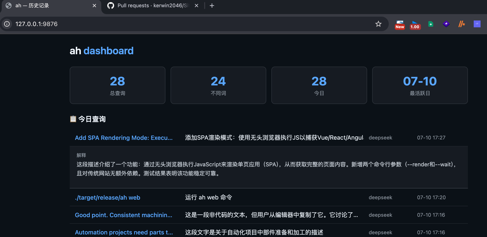

# ah

> Stay in flow.

**Instant AI explanations for anything you select.**

English · **[中文](README.md)**

Translate terminology, explain code, understand APIs and unfamiliar identifiers —
without leaving your terminal.

Named after that instinctive "ah?" — the moment you hit an unfamiliar identifier.

<p align="center">
  
</p>

<p align="center">
  
</p>

## Quick Start

```bash
# Build from source and start the daemon (recommended)
./start.sh

# Or install manually
cargo install --path .

# First-time AI setup
ah init
```

Once your API key is configured, daily use is simple:

```
Select text → Ctrl+C to copy → translation and explanation appear
```

## Installation

```bash
# One-line install (Linux / macOS, x86_64 / aarch64)
curl -sSL https://raw.githubusercontent.com/USER/ah/main/install.sh | bash

# Homebrew (macOS)
brew install USER/ah/ah

# Build from source
cargo install --path .
```

Make sure `~/.local/bin` is on your `PATH`:

```bash
export PATH="${HOME}/.local/bin:${PATH}"
```

## Core Concept

`ah` is built around one action: **turn selected text into an understandable explanation**. Three ways to trigger it, depending on your workflow:

| Method | Command | Best for |
|--------|---------|----------|
| Copy trigger | `ah daemon` | Universal — works in any app |
| Hotkey trigger | `ah grab` | When you don't want to touch the clipboard |
| Manual query | `ah explain` | Scripts, pipes, precise control |

All three share the same AI backend, filtering rules, and history.

---

## Usage

### Copy to Explain (Recommended)

A background daemon watches the clipboard and explains on copy:

```bash
export TX_DEEPSEEK_KEY="sk-..."   # or another provider
ah daemon &
```

`./start.sh` handles build, install, and daemon startup in one step.

Daemon behavior:

- **Debounce** 800ms — rapid copies trigger only once
- **Dedup** — identical content won't be explained twice
- **Filter** — skips bare URLs, pure numbers, punctuation-only, and text under 2 characters
- **Single instance** — prevents multiple daemons from running

```bash
tail -f ~/.local/share/ah/daemon.log   # view logs
pkill -f 'ah daemon'                   # stop daemon
```

### Explain a Word

```bash
ah explain map
ah explain --expand serialize          # detailed explanation
ah explain --json useEffect            # JSON output for scripting
ah explain --to 中文 replicate          # target translation language
```

### Pipe Mode

Read from stdin — ideal for editor integration:

```bash
echo 'Array.prototype' | ah explain --pipe
```

### File Context

Read surrounding source lines so the AI can explain in context:

```bash
ah explain -f src/main.rs:42
ah explain -f src/providers/ollama.rs:15 -c 10   # 10 lines of context
```

### Hotkey: Select to Explain

`ah grab` reads the mouse selection directly — **without touching the clipboard**:

```bash
ah grab                          # terminal output
ah grab --quiet                  # desktop notification only
ah grab --source primary         # PRIMARY selection only
```

Dependencies (pick one for your session):

| Session | Package | Command |
|---------|---------|---------|
| Wayland | `wl-clipboard` | `wl-paste` |
| X11 | `xclip` or `xsel` | `xclip` / `xsel` |

**GNOME** — run `./scripts/setup-hotkey.sh` to bind Ctrl+E, or configure manually:

```bash
gsettings set org.gnome.settings-daemon.plugins.media-keys custom-keybindings \
  "['/org/gnome/settings-daemon/plugins/media-keys/custom-keybindings/ah/']"
BASE=org.gnome.settings-daemon.plugins.media-keys.custom-keybinding:/org/gnome/settings-daemon/plugins/media-keys/custom-keybindings/ah/
gsettings set "$BASE" name 'ah grab'
gsettings set "$BASE" command 'ah grab --quiet --source primary'
gsettings set "$BASE" binding '<Super>e'
```

**Hyprland**: `bind = SUPER, E, exec, ah grab --quiet --source primary`

**Sway**: `bindsym $mod+e exec ah grab --quiet --source primary`

**i3**: `bindsym $mod+e exec --no-startup-id ah grab --quiet --source primary`

### Interactive Mode

```bash
ah ask
```

Enter a REPL — type a word, press Enter, get an explanation. Good for looking up several words in a row.

### History

Every query is saved automatically:

```bash
ah history                  # last 20 entries
ah history -n 50            # last 50
ah history -s serde         # search
ah history --stats          # statistics
ah tui                      # interactive TUI browser
```

---

## Editor & Terminal Integration

`ah` doesn't lock you into a specific tool — it connects through pipes and the clipboard.

### Vim / Neovim

```bash
cp -r vim-ah ~/.vim/pack/plugins/start/vim-ah
# vim-plug: Plug '~/path/to/ah/vim-ah'
```

| Action | Effect |
|--------|--------|
| `<leader>kt` | Explain word under cursor |
| `:AH map` | Explain a specific word |
| `y` / `yy` | Auto-explain on yank (enabled by default) |

Disable auto-explain: `let g:ah_yank_auto = 0`

To trigger `ah daemon` from Vim yanks, sync to the system clipboard:

```vim
set clipboard=unnamedplus
```

Neovim uses floating windows; Vim uses a scratch buffer.

### tmux

Add to `~/.tmux.conf`:

```tmux
bind-key -T copy-mode-vi x send -X copy-pipe-and-cancel \
    "ah explain --pipe | tmux display-popup -w80% -h50% -T 'ah explain'"
```

`prefix + [` → select a word → `x` → popup with explanation.

Or source the plugin directly: `run ~/path/to/ah/tmux-ah/ah.tmux`

### Kitty

```bash
cp kitty-ah/ah-kitty.sh ~/.local/bin/
```

In `~/.config/kitty/kitty.conf`:

```
map ctrl+e shell -x ah-kitty.sh
```

Select text → `Ctrl+E` → new window with explanation.

### WezTerm

In `~/.config/wezterm/wezterm.lua`:

```lua
require 'wezterm-ah'

local keys = {
  { key = 'e', mods = 'SUPER', action = wezterm.action.EmitEvent('ah-explain') },
}
```

Select text → `Super+E` → split pane with explanation.

---

## Configuration

Config file: `~/.config/ah/config.toml`

Run `ah init` for an interactive wizard, or create manually:

```toml
[provider]
default = "auto"    # auto / ollama / openai / deepseek / anthropic

[provider.ollama]
model = "llama3.2"
url = "http://localhost:11434"

[provider.openai]
model = "gpt-4o-mini"
# api_key = "sk-..."    # or use env vars

[provider.deepseek]
model = "deepseek-chat"
url = "https://api.deepseek.com/v1"

[display]
theme = "auto"
```

Environment variables take precedence over the config file:

| Variable | Purpose |
|----------|---------|
| `TX_OPENAI_KEY` | OpenAI API Key |
| `TX_DEEPSEEK_KEY` | DeepSeek API Key |
| `TX_ANTHROPIC_KEY` | Anthropic API Key |
| `TX_PROVIDER` | Force a specific provider |

### AI Providers

| Name | Type | Default Model |
|------|------|---------------|
| Ollama | Local | `llama3.2` |
| OpenAI | Cloud | `gpt-4o-mini` |
| DeepSeek | Cloud | `deepseek-chat` |
| Anthropic | Cloud | `claude-3-haiku` |

Resolution order:

1. `--provider` flag
2. `[provider] default` in config
3. Auto-detect: try local Ollama first, then check configured cloud API keys

---

## Output Example

```
────────────────────────────────
翻译: 迭代器

解释: Rust 中用于遍历集合的 trait。
通过 .next() 方法逐个返回元素，
支持 for 循环和各种适配器。

用法:
  for item in vec.iter() {
      println!("{item}");
  }
────────────────────────────────
```

---

## Command Reference

```
ah explain <word>       Explain a word
ah explain --pipe       Read from stdin
ah explain -f file:line Explain with file context
ah daemon               Copy-to-explain (background)
ah grab                 Explain current selection
ah grab --quiet         Notification only
ah ask                  Interactive mode
ah tui                  History TUI browser
ah history              View history
ah history --stats      Query statistics
ah init                 Initialize config
ah config               Show current config
```

---

## Project Structure

```
ah/
├── src/            Core Rust implementation
├── vim-ah/         Vim / Neovim plugin
├── tmux-ah/        tmux integration
├── kitty-ah/       Kitty integration
├── wezterm-ah/     WezTerm integration
├── scripts/        Install & test scripts
├── start.sh        One-command build + daemon
└── install.sh      Remote install script
```

---

<p align="center">
  <sub>Stay in flow.</sub>
</p>
